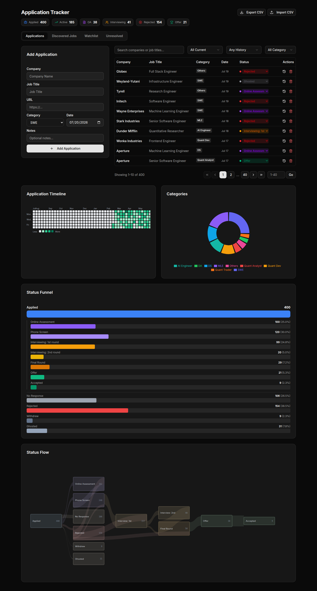
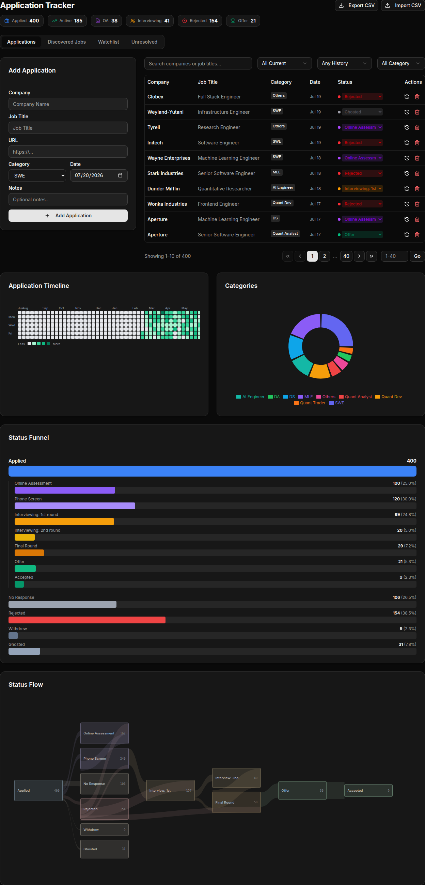
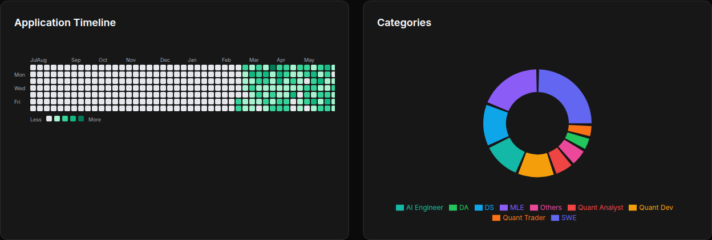
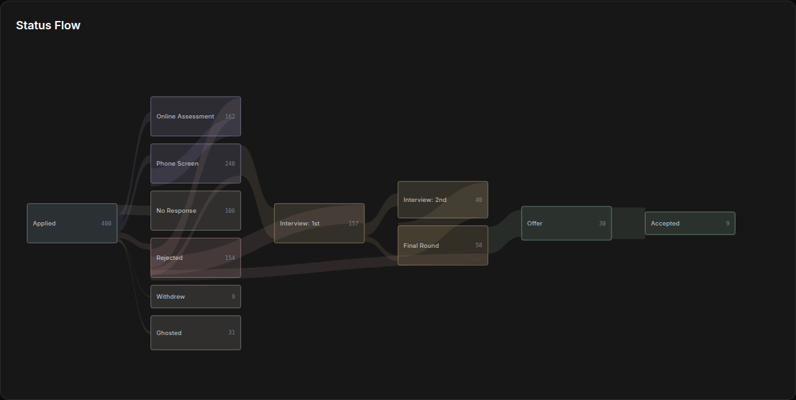

# Job Matchbook

**The job tracker that finds your matches for you.**

[](https://github.com/drink970082/job-matchbook/actions/workflows/ci.yml)
[](./LICENSE)

*match* — it watches company job boards, screens each posting against your hard
requirements, and scores fit against your résumé.
*book* — every match you act on is tracked: status history, KPIs, charts.

> **Watch company boards → screen out hard mismatches → score résumé fit →
> alert you → track the application.**

You review and apply by hand. No auto-apply, no résumé farming — a human is always
in the loop.

<p align="center">
  
</p>

## Who it's for

Job seekers watching more companies than they can check by hand, with hard
constraints a keyword alert can't express — sponsorship, location, degree,
clearance, seniority band. It's self-hosted: your résumé and application history
live in a SQLite file you own. (Fit scoring does send each JD plus your résumé to
whichever backend you configure — Codex CLI or Claude.)

It is **not** an employer-side ATS, it does not apply on your behalf, and it never
logs in to a job board or works around a CAPTCHA — it reads public listings.

---

## Features

**Discover** — the worker scans watched company boards and external feeds; the
**Discovered Jobs** tab triages everything into five buckets: **Matched** (cleared
the seniority + domain gate the worker notifies on), **Below bar**, **Discarded**
(failed hard-requirement screening), **Failed** (pipeline error), and **Low-context**
(JD too thin to score fairly). Sort by best match or newest, filter by score and
disqualification cause.

**Screen** — a local LLM drops postings that violate your hard requirements before
anything expensive runs.

**Score** — surviving postings are scored against your résumé, reason first. Every
row carries a "why" subline (verdict pills plus the top missing must-have, or the
disqualification reason) and a recommended-résumé label; open one for the full JD,
must-haves met vs. missing, and a one-line summary. Telegram pings you on the best
matches.

**Track** — **Mark Applied** promotes a posting into a tracked application. Header
KPIs, a searchable table with inline status editing and per-application history, CSV
import/export, and four dashboards: an activity heatmap, a category donut, a status
funnel, and a status-flow Sankey reconstructed from history.

<p align="center">
  <br>
  <br>
  
</p>

---

## Quick start

**Tracker only (~5 min)** — the web app on its own. You add applications by hand;
the Discovered Jobs queue stays empty until you set up the worker.

```bash
make install && make db-push && make dev     # → http://localhost:3000
```

**Full pipeline** — adds discovery, screening, scoring and alerts. You'll need
Python 3.11, a screening backend, and a fit-score backend. **No GPU required:** the
screen runs on a local Ollama if you have one, and on Codex, Claude Code, the
Anthropic API or the OpenAI API if you don't. Fit scoring runs on the Codex CLI + a
ChatGPT subscription by default, or Claude with an API key. Telegram is optional.

```bash
make setup     # web + worker deps, DB, config templates (never clobbers yours)
               # then fill in apps/worker/{config.yaml,.env} + resume/resume.txt
make doctor    # preflight: what's present, what's missing
make up        # web app, in Docker
cd apps/worker && python -m ats_worker.run --once   # the worker runs natively
```

The worker is deliberately *not* containerized — it runs natively so it can reach a
host-side Ollama (if you use one) and whichever provider CLI you are logged in to
(`codex login`, `claude`). [**`docs/SETUP.md`**](./docs/SETUP.md) has the full prerequisite
table, the three things that surprise everyone, and where each setting lives.

---

## Supported sources

11 platform adapters — Greenhouse, Lever, Ashby, Workday, SmartRecruiters, Workable,
Pinpoint, iCIMS, Phenom, Oracle, Jobvite — plus generic custom-HTTP and browser
recipe executors for boards without a usable API. 11 of those 13 can be watched
per-company; Oracle and Jobvite only resolve listings that arrive via a discovery
feed.

## How it works

One project, two cooperating services sharing a single SQLite database:
[`apps/web`](./apps/web) is the Next.js tracker and dashboards you interact with;
[`apps/worker`](./apps/worker) is the Python pipeline that feeds it.

Next.js 14 (App Router, Server Actions) · TypeScript · Prisma 6 + SQLite ·
React 18 · Tailwind CSS 4 · Radix UI · Recharts + hand-rolled SVG charts ·
Python 3.11 worker (APScheduler, Ollama, Codex CLI, Claude, Telegram) ·
Jest + Playwright + pytest · Docker Compose. Details in
[`docs/SPEC.md` §6](./docs/SPEC.md#6-architecture).

---

## Documentation

| Doc | What |
|-----|------|
| [`docs/SETUP.md`](./docs/SETUP.md) | Setup front door — prerequisites, gotchas, tracker-only vs. full-pipeline paths, and where each setting lives |
| [`docs/SPEC.md`](./docs/SPEC.md) | **Authoritative system spec + capability map** — architecture, components, data model, behaviors, setup, testing |
| [`docs/PROGRESS.md`](./docs/PROGRESS.md) | Live delta — in flight, the pick order, open defects (capabilities → SPEC, history → CHANGELOG) |
| [`docs/BACKLOG.md`](./docs/BACKLOG.md) | The open catalogue — unverified/deferred behavior and optional enhancements |
| [`docs/REJECTED.md`](./docs/REJECTED.md) | Proposals evaluated and turned down, with the measurement that killed each |
| [`CONTRIBUTING.md`](./CONTRIBUTING.md) | Conventions and how to run tests |
| [`CHANGELOG.md`](./CHANGELOG.md) | Release history |
| [`CODE_OF_CONDUCT.md`](./CODE_OF_CONDUCT.md) | Community expectations (Contributor Covenant) |
| [`SECURITY.md`](./SECURITY.md) | Vulnerability reporting + accepted-risk scope |

---

## License

[MIT](./LICENSE).
